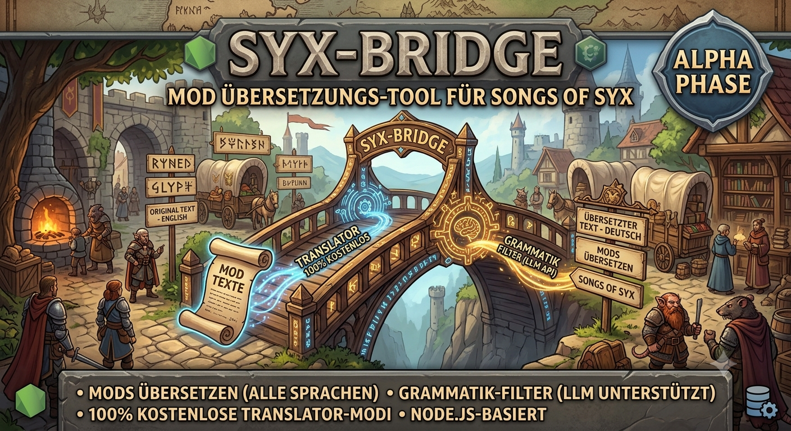
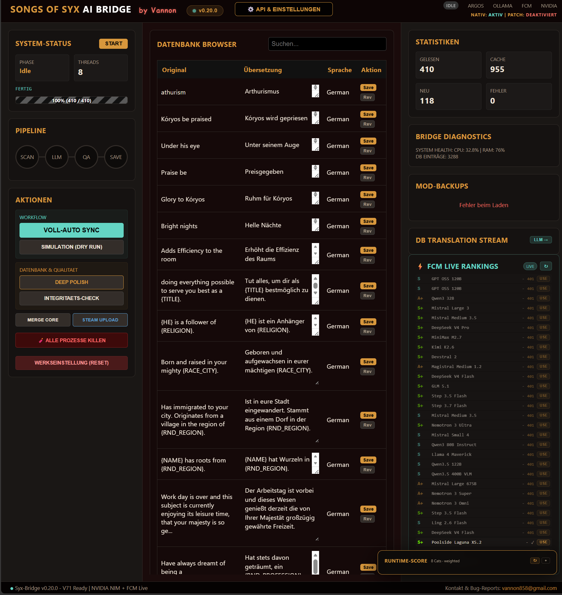
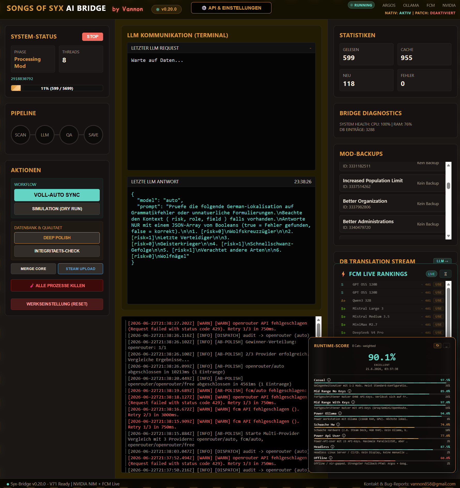
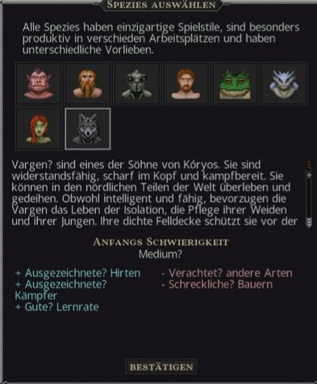
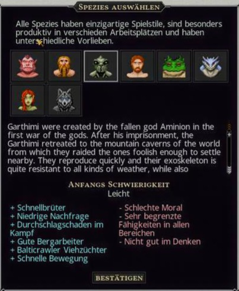

# SyxBridge — KI-Übersetzung für Spiel-Mods

<p align="center">
  
</p>

<p align="center">
  
  
  
  
  
  
</p>

> [!NOTE]
> **Aus Versehen gebaut. Läuft mit Absicht. / Built by accident. Runs on purpose.**  
> *"Ich wollte nur meine Mods auf Deutsch spielen. Jetzt hab ich eine KI-Pipeline mit Web-Dashboard, Key-Rotation, Capability-Matrix und Stresstest-System. Irgendwas ist schiefgelaufen."*  
> *"I just wanted to play my mods in German. Now I have an AI pipeline with a web dashboard, key rotation, capability matrix, and stress test system. Something went wrong."*

---

## 📖 Real Use Cases / Warum existiert das hier?

| 🇬🇧 English | 🇩🇪 Deutsch |
|:---|:---|
| **Scenario 1: You have 50 mods. They're all in English.**<br>You could read English fine. But your family or friends don't. You want to play together. Run `start.bat`. Get a coffee. Come back in 20 minutes. Your mods are translated. Every species screen, every trait, every piece of lore — done. | **Szenario 1: Du hast 50 Mods. Alle auf Englisch.**<br>Du könntest Englisch notfalls lesen. Aber deine Familie/Freunde nicht. Ihr wollt zusammen spielen. Starte `start.bat`. Hol dir einen Kaffee. Komme in 20 Minuten wieder. Deine Mods sind übersetzt. Jeder Screen, jedes Trait — erledigt. |
| **Scenario 2: You released a mod. Players want it translated.**<br>You built something cool. Run SyxBridge in Patch Mode — it generates a separate translation mod you can upload directly to the Steam Workshop. Your original mod stays untouched. | **Szenario 2: Du hast einen Mod veröffentlicht. Die Spieler wollen ihn übersetzt.**<br>Du hast was Cooles gebaut. Starte SyxBridge im Patch-Mode — er generiert einen separaten Übersetzungsmod, den du in den Workshop hochladen kannst. Original-Mod bleibt unangetastet. |
| **Scenario 3: You want quality, not slop.**<br>Google Translate mangles lore. SyxBridge remembers. It builds a glossary, shields game-specific terms, audits its own output, and polishes the result. "Hive Queen" stays "Hive Queen" consistently. | **Szenario 3: Du willst Qualität, kein Matsch.**<br>Google Translate zerstört Lore. SyxBridge erinnert sich. Es baut ein Glossar, schützt Spielbegriffe, prüft seine eigene Ausgabe und poliert das Ergebnis nach. „Schwarm-Königin" bleibt „Schwarm-Königin". |

---

## ⚡ Architecture & Pipeline

> [!IMPORTANT]  
> **The short version:** First run does the work. Every run after that is just cache hits. API cost after the first sweep? Near zero. (Der erste Lauf macht die Arbeit. Danach nur Cache-Hits. API-Kosten? Nahezu null.)

<details>
<summary><b>🔍 Step-by-Step Pipeline (Click to expand)</b></summary>

1. 📁 **Scan & Shield:** Scans mod files & replaces placeholders (e.g. `{NAME}`) with shields (`__SHLD_0__`) so AI doesn't break game logic.
2. 🤖 **Translate & Audit:** The best available AI translates. If the risk score is high (ambiguous text), a second AI model audits it.
3. ✨ **Polish & Restore:** Text is polished to fit game lore. All shields are restored. `{VAR}` is never hallucinated into `[VAR]`.
4. 💾 **Cache & Write:** Saved permanently to SQLite and written to game files. 3,200+ entries cached. 0 watermarks.

</details>

---

## 🤖 Smart Routing: 8 AI Providers

A dynamic capability matrix routes your text to the best available provider. Automatic key rotation prevents rate limits. Keys stay local in your `.gitignore`'d `.env` file!

- 🌱 **Free Tier:** Google Translate (Built-in), Argos Offline (Local), FCM Daemon (Always on)
- 🔑 **API Key Providers:** Groq (Fast), OpenRouter (Flexible), Gemini (Quality), NVIDIA NIM (Credits)
- 💻 **Local Models:** Ollama (Opt-in, Local GPU needed)

---

## 📸 The Dashboard

| Idle Mode · DB Browser | Run Mode · Live Terminal |
|:---:|:---:|
|  |  |
| *Browse 3,200+ cached translations. Edit entries. Check provider health.* | *Watch the AI work in real time. Live prompts, progress bars. No black box.* |

---

## 🎮 In-Game Results

| Vargen (Full DE) | Onari (Traits + UI) | Garthimi (Mixed - Not Cached Yet) |
|:---:|:---:|:---:|
|  |  |  |

> [!TIP]  
> Mixed results (like the 3rd screenshot) are expected initially if a mod isn't fully in the DB yet. Run it one more time and the cache resolves it seamlessly.

---

## 🛠️ Quickstart (4 Steps)

```bash
# 1. Install Node.js (v18+)
#    → https://nodejs.org/

# 2. Clone
git clone https://github.com/vannon091118/Syx_bridge-
cd Syx_bridge-

# 3. API Keys (optional — works without them using Free Tier)
#    Copy .env.example → .env, add at least one key

# 4. Launch
start.bat
```
*The `.bat` installs dependencies, starts the server, and opens `localhost:3000`. Add keys under **⚙️ Manage API Keys**, hit **Apply Changes**. Go make coffee.*

---

## 📊 Modes: Native vs. Patch

- **Native Mode (✅ Default):** Writes directly into your installed mod files. Original files are automatically backed up before overwrite. For personal play.
- **Patch Mode (Opt-in via `.env`):** Creates a separate mod folder alongside the original. Original files are completely untouched. For modders publishing translations to Steam Workshop.

---

## ⚠️ Honest Status (Alpha)

> [!CAUTION]  
> This is a solo project in active development. I play on it every day, but it is still Alpha software.

- **DB:** ~3,288 translated entries · 0 watermarks
- **Runtime Score:** 90.1% — probability it runs on your machine without intervention.
- **Tests:** 111 PASS · 0 FAIL
- **"Untested" tags:** Every release gets `-untested` until confirmed on a non-dev machine. It just means I haven't verified it on a second setup yet.

---

## 🗺️ Roadmap & Future Vision

- [x] **Phase 1: Core Foundation (v0.23)** — Songs of Syx Integration, Plugin Architecture, Full Pipeline, Web Dashboard.
- [ ] **Phase 2: Structural Expansion** — RimWorld Plugin (Adapter for Mod-Folders, Defs, Keyed files), Mod-Loader (DAG Load-Order), Conflict Detection.
- [ ] **Phase 3: Ecosystem Integration** — Mod Browser, SteamCMD Integration, NexusMods API.
- [ ] **Phase 4: Community & More Games** — Kenshi + Stardew Valley support, Shared glossaries, Global translation caches.

---

## 📧 Contact & Bug Reports

Email: [vannon858@gmail.com](mailto:vannon858@gmail.com)

> [!WARNING]  
> When filing a bug, include `log.txt` and `debug_payloads.txt` (from `core/`). Always mask your API keys in the `.env` file before sending!

---

<p align="center">
  <em>Kein Scrum-Master wurde bei der Entwicklung dieses Projekts verletzt.</em><br>
  <em>No Scrum Masters were harmed during the development of this project.</em><br>
  <sub>MIT License · © 2026 Vannon · Happy Slaver-Management! 🎮</sub>
</p>
