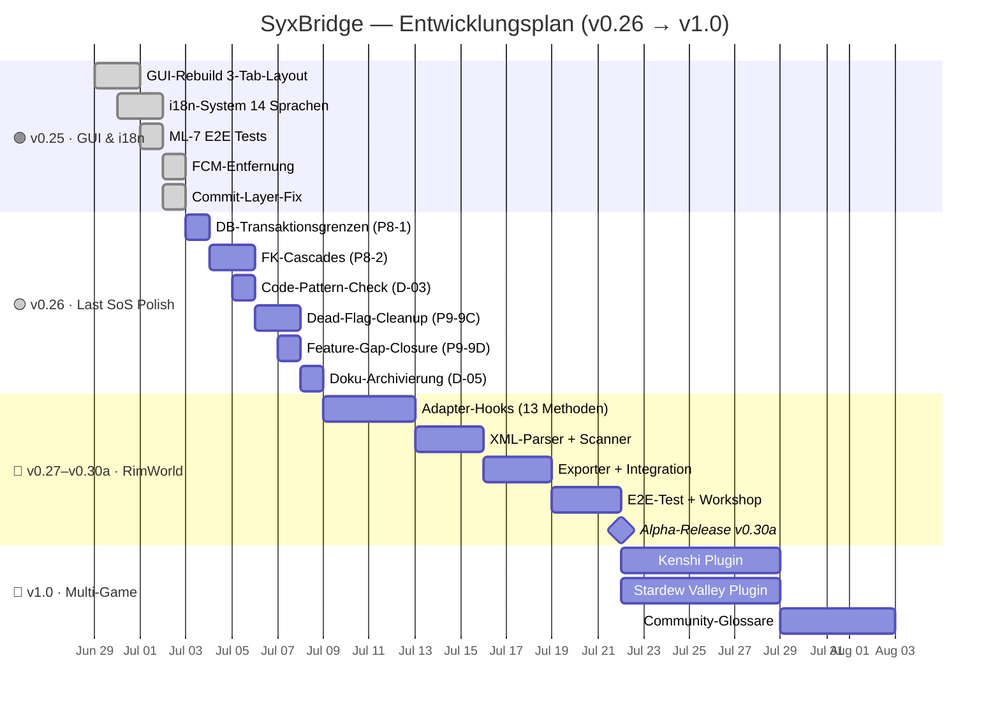

# 🗺 SyxBridge — Roadmap

> **Stand:** 2026-07-02 | **Aktuelle Version:** v0.25.0-alpha
> **SSOT:** Diese Datei ist die Single Source of Truth für die Projekt-Roadmap.
> README.md, PLAN.md, AGENTS.md referenzieren diese Datei.

---

## 📊 Mermaid Timeline — Komplette Projekt-Historie

```mermaid
timeline
    title SyxBridge — Entwicklungsgeschichte (v0.10 → v1.0)
    section 🧪 Origins (pre-CHANGELOG)
        v0.10 : Proof of Concept
              : Erster funktionierender Übersetzungslauf
        v0.15 : Erster Release
              : start.bat, .env-System, Groq+Gemini+OpenRouter
    section 🏗️ Foundation · Songs of Syx Core
        v0.19 : Plugin-Architektur (3 Ebenen)
              : SQLite-Cache + Revisionshistorie
              : Erster vollständiger Mod-Sync
              : 7 Provider integriert
        v0.20 : Commit-Layer RNG (deterministisch)
              : 9 Provider · Composite-Hash-System
              : Web-Dashboard MVP
              : Plugin-Boundary-Contract (84 Checks)
        v0.21 : Placeholder-Shield-System
              : FCM Live-Rankings
              : isProperNoun() 200+ Denylist
              : Narrative Expansion (9→14 Charaktere)
              : SQLITE-BUSY-Fix · ZWSP-Removal
        v0.22 : P0 __OVERWRITE-Crash-Fix
              : Groq Garbage-Detection
              : 11 Provider (OpenAI + Custom API)
              : isFreeModel() + rankModel() DB-gestützt
              : Language-Tag + Translation-Credit
    section 🎨 Polish · Songs of Syx Refinement
        v0.23 : Bilinguales README (DE/EN)
              : Code-Refactoring M-1..M-4
              : RimWorld Plugin Foundation
              : Narrative Commit-Layer komplett
              : Doku-Divergenz-Audit (DD-001–DD-007)
              : 14 Erzähler mit Voice-Templates
        v0.24 : ESLint-Hardening (7669→96 Issues)
              : 3 Domain-DAOs (mod-tracker, run-metrics, admin)
              : PREF-IGNORE 5 Routing-Bugs
              : GUI Modularisierung (5 Module)
              : Provider-Extraktion (chat-config, argos, gemini)
    section 🖥️ GUI & i18n · Aktuelle Version
        v0.25 : GUI-Rebuild (3-Tab-Layout)
              : i18n-System (14 Sprachen)
              : ML-7 E2E Tests (166/166 PASS)
              : Grammar Context Files (14 Sprachen)
              : PROPER-NOUN Pluginisierung
              : FCM-Entfernung · Commit-Layer-Fix
        v0.25.0-alpha : Aktueller Stand · 2026-07-02
    section ✨ Final Polish · Songs of Syx Abschluss
        v0.26 : DB-Persistenz-Härtung (P8-1..P8-8)
              : Transaktionsgrenzen + FK-Cascades
              : Code-Pattern-Check + Dead-Flag-Cleanup
              : Feature-Gap-Closure (→95%)
              : Bug-Triage-Report Automatisierung
              : Dokumenten-Archivierung
              : Letzter SoS-Polish vor RimWorld
    section 🎯 RimWorld · Implementierung
        v0.27 : RimWorld Adapter-Hooks (13 Methoden)
              : scanMod · parseMetadata · getLauncherSettings
              : applyPatchModifications · Backup-System
        v0.28 : RimWorld Scanner & Parser
              : XML-Parser für Def-Dateien
              : Mods/-Struktur-Scanner
              : XML-Exporter für LanguageData
        v0.29 : RimWorld Integration & Tests
              : Plugin-Boundary-Contract (89 Checks)
              : RimWorld E2E-Test
              : About.xml + Workshop-Integration
        v0.30a : RimWorld Alpha-Release
              : Vollständiger EN→DE Sync
              : Steam-Workshop Upload
              : Dokumentation abgeschlossen
    section 🌍 Multi-Game · Zukunft
        v1.0 : Kenshi · Stardew Valley
              : Mod-Loader · Community-Glossare
              : Geteilte Glossar-Caches
```

---

## 📋 Versionstabelle — Features & Status

| Version | Name | Schwerpunkt | Provider | Tests | Status |
|:---:|:---|:---|:---:|:---:|:---:|
| **v0.10** | Proof of Concept | Übersetzungslauf funktioniert | 3 | — | 🟢 DONE |
| **v0.15** | First Release | start.bat, .env-System | 3 | — | 🟢 DONE |
| **v0.19** | Plugin Foundation | 3-Ebenen-Architektur, SQLite | 7 | 84 | 🟢 DONE |
| **v0.20** | Commit RNG | Web-Dashboard, Composite-Hash | 9 | 84+35 | 🟢 DONE |
| **v0.21** | Shield & Lore | Placeholder-Schutz, Narrative | 9 | 119 | 🟢 DONE |
| **v0.22** | Crunch Time | Crash-Fixes, 11 Provider | 11 | 119 | 🟢 DONE |
| **v0.23** | Polish Pass | Refactoring, RimWorld-Basis | 11 | 111 | 🟢 DONE |
| **v0.24** | Hardening | ESLint, DAOs, PREF-IGNORE | 10* | 119 | 🟢 DONE |
| **v0.25** | **GUI & i18n** | **3-Tab-Layout, 14 Sprachen** | **10*** | **287** | 🟣 **AKTIV** |
| **v0.26** | Last SoS Polish | DB-Härtung, Cleanup | 10* | 287+ | 🟡 GEPLANT |
| **v0.27** | RW Adapter | 13 Adapter-Hooks | 10* | 287+ | 🟡 GEPLANT |
| **v0.28** | RW Scanner | XML-Parser, Exporter | 10* | 287+ | 🟡 GEPLANT |
| **v0.29** | RW Integration | E2E-Test, Workshop | 10* | 300+ | 🟡 GEPLANT |
| **v0.30a** | **RW Alpha** | **Erster RimWorld-Sync** | **10*** | **300+** | 🔮 ZUKUNFT |
| **v1.0** | Multi-Game | Kenshi, Stardew Valley | TBD | TBD | 🔮 VISION |

> \* FCM in v0.24 entfernt (v0.25.0-alpha). 11→10 Provider.

---

## 🎯 Checkpoints

| Checkpoint | Version | Status | Kriterium |
|:---:|:---:|:---:|:---|
| 🏁 **CP-1** | v0.20 | ✅ | Plugin-Architektur, SQLite-Cache, erster Sync ohne Crash |
| 🏁 **CP-2** | v0.22 | ✅ | 11 Provider, Vanilla-Texte nicht mehr zerstört |
| 🏁 **CP-3** | v0.23 | ✅ | Code aufgeräumt, RimWorld Foundation, README professionell |
| 🏁 **CP-4** | v0.25 | ✅ | GUI-Rebuild, i18n, 287 Tests, E2E-Multi-Language |
| 🔄 **CP-5** | v0.26 | 🟡 | SoS-Finalisierung — DB-Härtung, Dead-Flag-Cleanup, Bugs geschlossen |
| 🔄 **CP-6** | v0.30a | 🟡 | Erster RimWorld EN→DE Sync, Workshop-Upload |
| 🔮 **CP-7** | v1.0 | 🔮 | Kenshi + Stardew Valley, Community-Glossare |

---

## 📊 Mermaid Gantt — Geplanter Ablauf

---

## 🔗 Referenzen

- **Aktueller Plan:** [PLAN.md](PLAN.md) — Detaillierte Task-Liste mit Aufwandschätzungen
- **Changelog:** [CHANGELOG.md](CHANGELOG.md) — Vollständige Commit-Historie
- **Architektur:** [AGENTS.md](AGENTS.md) §13 — Plugin-Schicht, GUI, Status
- **Vision:** [VISION.md](VISION.md) — Multi-Game Langzeit-Scope (READ-ONLY)

---

*Erstellt 2026-07-02 — Roadmap als zentrale Single Source of Truth.*
*Versionen rückwirkend aus CHANGELOG.md abgeleitet.*
